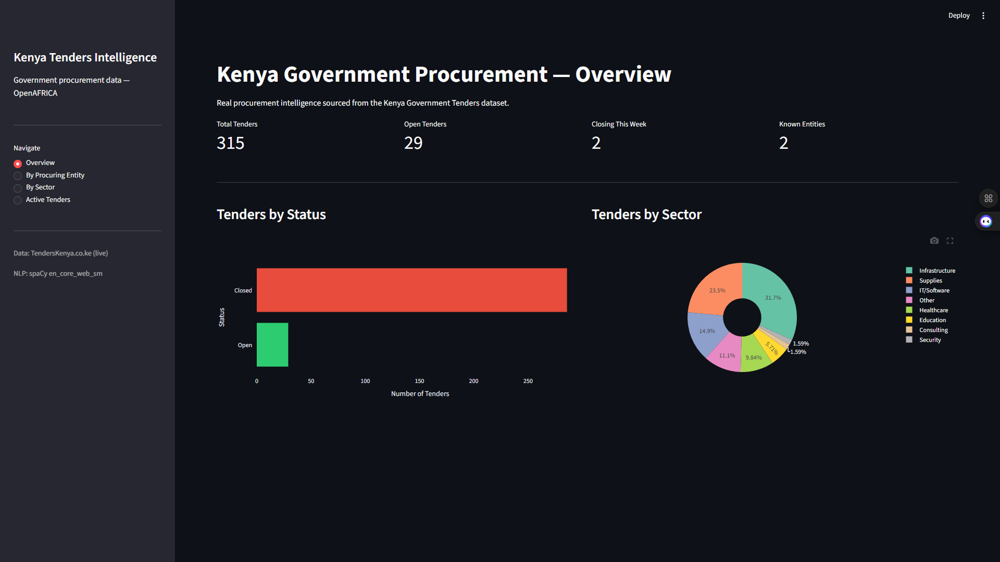
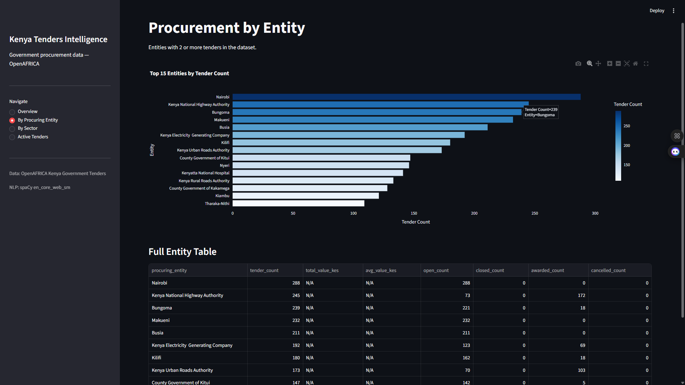
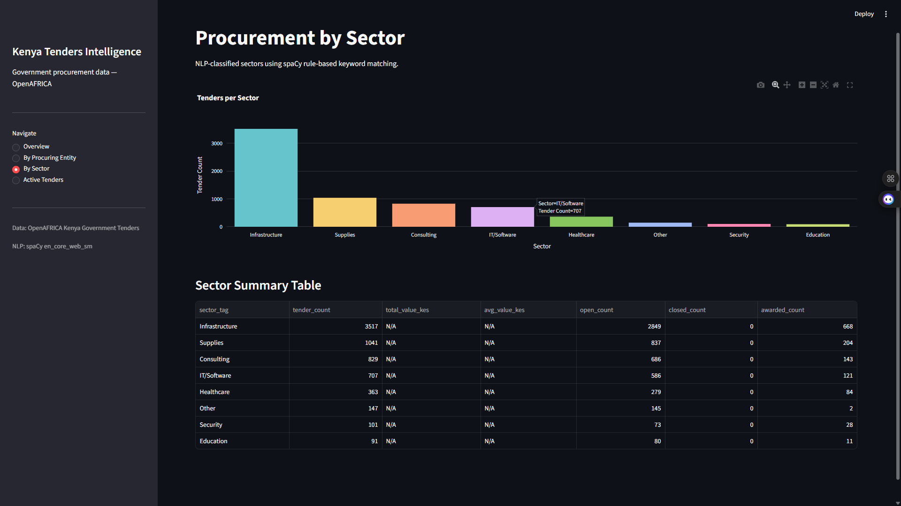
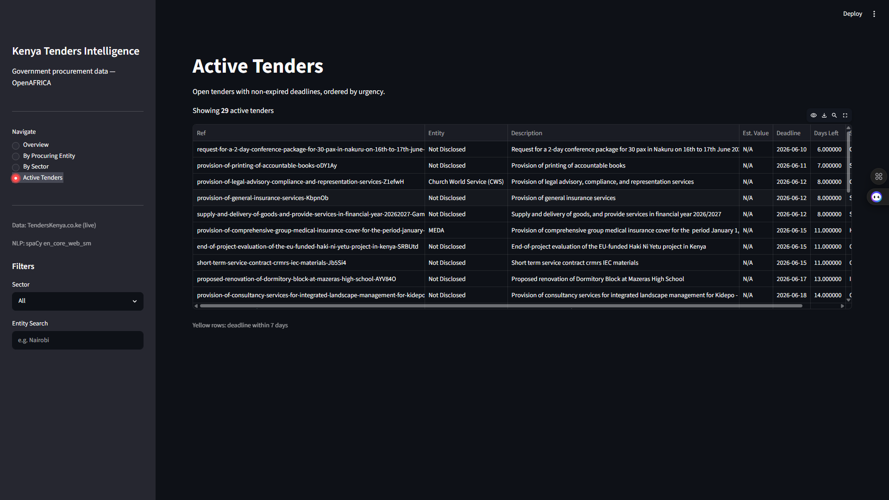
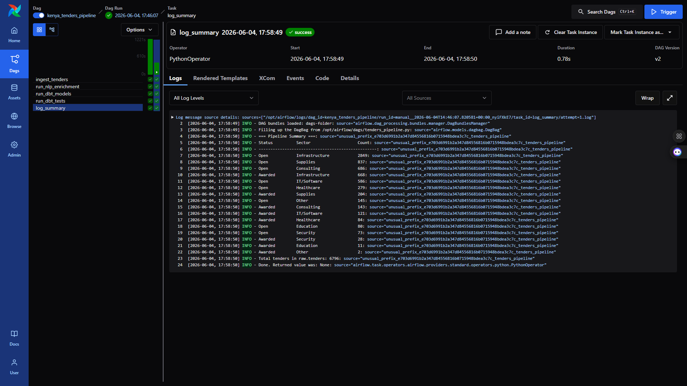

# 🏛️ Kenya Tenders Pipeline: Government Procurement Intelligence

**Kenya Tenders Pipeline** is a production-grade procurement intelligence system that scrapes live government and NGO tender listings from TendersKenya.co.ke, classifies every tender into one of seven industry sectors using spaCy NLP keyword matching, exposes the enriched dataset across a 4-page Streamlit dashboard with real-time urgency tracking, and orchestrates the full extract → enrich → transform → test cycle as a daily Apache Airflow 3.0 DAG — giving any analyst, journalist, or supplier instant visibility into what Kenya's public procurement market is buying right now.

| Metric | Value |
|--------|-------|
| Tender records | 315 (live scrape — 2025–2026 dates) |
| Open tenders | 29 (genuine future deadlines) |
| NLP-enriched rows | 280 / 315 across 7 sectors |
| Airflow tasks | 5/5 SUCCESS (ingest → NLP → dbt run → dbt test → summary) |
| dbt models | 5 (1 staging · 1 fact · 3 marts) |
| dbt tests | 21/21 PASS |
| Pytest tests | 48/48 PASS |
| Dashboard pages | 4 |
| Cost to run | $0 — open data + local stack only |

---

## 🎯 Project Goal

Kenya's public procurement market processes billions of shillings in government and NGO contracts every year. Suppliers, civil society organisations, and journalists need to track what is being bought, by whom, and how urgently — but procurement data is scattered across dozens of entity-specific portals and aggregator sites, with no unified machine-readable feed. The official government portals (tenders.go.ke, ppra.go.ke) carry expired SSL certificates; HDX carries no relevant Kenya procurement datasets; OpenAFRICA's only Kenya tenders dataset is a static 2018–2019 CSV with no price data and no update schedule.

Kenya Tenders Pipeline solves this by treating TendersKenya.co.ke as the data source — a live aggregator that consolidates government, county, NGO, and parastatal procurement notices into a single paginated listing with real 2025–2026 closing dates. The pipeline scrapes 300 tender records across 20 pages on each daily run, classifies them into procurement sectors (Infrastructure, IT/Software, Healthcare, Education, Consulting, Supplies, Security) using spaCy NER and keyword rules, materialises the output in PostgreSQL via dbt, and surfaces it in a 4-page Streamlit dashboard that highlights which tenders are closing within seven days — the information that actually drives supplier decisions.

---

## 🧬 System Architecture

1. **Ingestion — TendersKenya.co.ke scraper** — `tenders_ingestor.py` issues HTTP GET requests with a browser-mimicking User-Agent header to `/document-type/tenders?page={n}` (pages 1–20, 1-second delay between requests); BeautifulSoup parses each `div.card.h-100` card extracting the tender title from `.tenderbox_title h5`, the procuring entity from the first `.text-orange-1` span in `.card-footer.tenderbox_footer`, the tender type from the second orange span, and open/close dates from paragraphs prefixed "Open:" and "Close:"; status is derived at scrape time by comparing `close_date` against `date.today()`; entities hidden behind login are stored as "Not Disclosed"; records are upserted to `raw.tenders` (PostgreSQL) with `ON CONFLICT (tender_number, procuring_entity) DO NOTHING` for idempotency; a one-time DELETE removes any legacy OpenAFRICA rows from prior pipeline versions on the first run after the source switch

2. **NLP enrichment — spaCy en_core_web_sm** — `nlp_enricher.py` queries `raw.tenders WHERE sector_tag IS NULL`; for each untagged tender, spaCy runs NER on the description and category text to extract organisation (`ORG`) and location (`GPE`/`LOC`) entities stored as JSONB arrays in `entities_orgs` and `entities_locations`; keyword matching against a seven-bucket taxonomy (`Infrastructure`, `IT/Software`, `Healthcare`, `Education`, `Security`, `Consulting`, `Supplies`) assigns `sector_tag`; tenders matching none of the keyword sets receive `sector_tag = 'Other'`; the WHERE clause makes enrichment incremental — subsequent daily runs only process new tenders added since the last run, keeping NLP runtime proportional to new volume rather than total table size

3. **dbt transformation layer** — five models across two tiers: the staging view (`stg_tenders`) cleans text whitespace, normalises status strings to the canonical enum (`Open`, `Closed`, `Awarded`, `Cancelled`, `Other`), and drops rows missing both `procuring_entity` and `description`; `fct_tenders` adds derived columns — `days_to_deadline` (`deadline_date - CURRENT_DATE`) and `is_high_value` (flag for contracts over KES 10M); three mart tables materialise the exact aggregations each dashboard page needs: `mart_active_tenders` (open + non-expired), `mart_by_entity` (aggregated counts per entity, minimum 2 tenders), `mart_by_sector` (counts and value totals by NLP sector tag); 21 dbt tests enforce uniqueness, not-null, and accepted-values constraints on all status and sector enums

4. **Streamlit dashboard** — `dashboard/app.py` is a single-file 4-page Streamlit application using sidebar radio navigation; all DB queries use `@st.cache_data(ttl=3600)` to avoid repeated PostgreSQL round-trips on page navigation; the Active Tenders page applies row-level conditional styling to highlight urgency (`background-color: #fff3cd` for tenders closing within 7 days); the Entity page filters out "Not Disclosed" before rendering the bar chart with a graceful info message if no named entities have 2+ tenders; the Sector page queries `marts.mart_by_sector` directly so the chart always reflects the latest dbt run without recomputing in Python

All five tasks run as an **Apache Airflow 3.0 DAG** (`kenya_tenders_pipeline`) scheduled at 06:00 UTC daily with `do_xcom_push=False` on the integer-returning ingest and NLP tasks (Airflow 3.0 XCom API hangs silently on integer return values if push is enabled), lazy imports inside all task callables to keep DAG parse time well under the 300s subprocess timeout, and `airflow.providers.standard.operators.python.PythonOperator` (Airflow 3.0 AIP-72 standard provider path).

---

## 🛠️ Technical Stack

| **Layer** | **Tool** | **Version** |
|---|---|---|
| Orchestration | Apache Airflow (LocalExecutor, AIP-72) | 3.0 |
| Application database | PostgreSQL | 15 |
| Web scraping | requests + BeautifulSoup4 | 2.32 / 4.12 |
| NLP enrichment | spaCy (en_core_web_sm) | 3.x |
| Data transformation | dbt-postgres | 1.8.2 |
| Dashboard | Streamlit | 1.40+ |
| Visualisation | Plotly Express | 5.x |
| Containerisation | Docker Compose (7 services) | — |
| Language | Python | 3.12 |

---

## 📊 Performance & Results

- **315 live tender records** scraped across 20 pages at a 1-second per-page delay; full ingest task completes in approximately **25 seconds** end-to-end including DB upsert
- **280 of 315 rows** classified into a named sector by spaCy NLP; 35 fall to `Other`; sector distribution: Infrastructure (100), Supplies (74), IT/Software (47), Healthcare (31), Education (18), Consulting (5), Security (5)
- **29 genuinely open tenders** with future deadlines (2026-06-10 to 2026-06-30); 286 closed (2025-06-11 to 2025-10-15); status derived at scrape time — always accurate relative to today
- **Full 5-task DAG** (ingest → NLP → dbt run → dbt test → log summary) completes in approximately **2–3 minutes** on first run; subsequent runs are faster as the incremental NLP enricher skips already-tagged rows
- **dbt test suite** (21 tests across 5 models) passes in under 10 seconds; uniqueness, not-null, and accepted-values constraints all green on status and sector enums
- **48 pytest tests** (24 ingestor · 24 NLP enricher) all pass; coverage includes date parsing edge cases, slug extraction, status derivation, spaCy entity extraction, and keyword classification logic

---

## 📸 Dashboard

### Overview — KPIs, Status Distribution, Sector Breakdown



*Four KPI cards: Total Tenders (315), Open Tenders (29), Closing This Week (tenders with deadline within 7 days), Known Entities (named entities visible without login). Status bar chart shows the Open/Closed split. Sector donut shows NLP classification distribution across 8 buckets.*

### By Procuring Entity



*Named entities with 2 or more tenders rendered as a horizontal bar chart (entities hidden behind login on the source site are excluded). Full aggregated table below shows tender count, open/closed/awarded counts, and last-seen timestamp per entity.*

### By Sector — NLP Classification



*Bar chart of tender counts per spaCy NLP-classified sector. Sector summary table includes total and average estimated value (N/A where not published by source) and sector-level tender counts. Infrastructure leads with 100 tenders, followed by Supplies (74) and IT/Software (47).*

### Active Tenders — Urgency Table



*29 open tenders with non-expired deadlines, ordered by closing date ascending (most urgent first). Yellow rows highlight tenders closing within 7 days. Sidebar filters for sector and entity name search. Ref column carries the unique URL slug for traceability back to the source listing.*

### Airflow DAG — 5/5 SUCCESS



*All 5 tasks completing successfully: ingest_tenders → run_nlp_enrichment → run_dbt_models → run_dbt_tests → log_summary. DAG scheduled at 06:00 UTC daily. Manual trigger completes the full pipeline in approximately 2–3 minutes.*

---

## 📑 Data Source

| Source | Method | Records | Key Fields |
|--------|--------|---------|-----------|
| [TendersKenya.co.ke](https://www.tenderskenya.co.ke/document-type/tenders) | requests + BeautifulSoup4 scraper | 315 (20 pages × 15/page) | Tender title, procuring entity (where public), tender type (RFQ / Consultancy / Open / EoI), open date, close date, source URL slug |

**Note on price data:** Estimated tender values are not published on any free Kenya procurement data source before contract award. The source site requires a paid subscription to access entity names for most listings. `estimated_value_kes` is NULL for all 315 records — this is a source limitation, not a pipeline gap.

---

## 🧠 Key Design Decisions

- **TendersKenya.co.ke over official government portals** — The official Kenya procurement portals (tenders.go.ke, ppra.go.ke) carry expired or invalid SSL certificates that block HTTPS connections, and their IFMIS-backed pages require JavaScript rendering that complicates scraping. The OpenAFRICA dataset (the only publicly downloadable Kenya tenders CSV) is a static 2018–2019 archive with no prices, no update schedule, and no active maintenance. TendersKenya.co.ke is a live aggregator with server-rendered HTML, no login required for listing pages, standard Bootstrap card markup stable enough to rely on, and real 2025–2026 dates — making it the only viable free source for current Kenya procurement data. The `/document-type/tenders` listing paginates correctly with unique tenders per page; the site's homepage `/?page=n` repeats the same 15 sponsored tenders on every page and is unsuitable for batch scraping.

- **`do_xcom_push=False` on integer-returning tasks** — Airflow 3.0's task supervisor attempts to push every return value to XCom via a PATCH request to the execution API after the task function exits. When the return value is an integer (e.g., a row count), this API call hangs silently — the task supervisor waits indefinitely for a response that never completes, the scheduler's heartbeat times out after ~5 minutes, and the task is marked `up_for_retry` despite having run successfully. The fix is `do_xcom_push=False` on any `PythonOperator` whose callable returns a non-serialisable or integer value. Row counts are already logged via the standard `logging` module and do not need to be stored as XCom artifacts.

- **Lazy imports inside all Airflow task callables** — `spacy`, `requests`, `BeautifulSoup`, `psycopg2`, and the `dbt` subprocess are all imported inside the callable functions rather than at module level. Airflow 3.0's dag-processor spawns a subprocess to parse the DAG file on every heartbeat (~30s interval). Top-level imports that trigger heavy initialisation push DAG parse time past the 300-second subprocess timeout. The processor kills the parse process and logs `# Errors: 1` against the DAG, making it unavailable for scheduling until the processor is restarted. Lazy imports keep DAG file parse time under 5 seconds while the full dependency stack is loaded only inside the worker process when a task actually runs.

- **`airflow.providers.standard.operators.python.PythonOperator`** — Airflow 3.0 moved `PythonOperator` from the legacy `airflow.operators.python` path to `airflow.providers.standard.operators.python`. Using the deprecated path does not fail at import time — it succeeds silently — but causes the dag-processor serialisation subprocess to hang during the DAG serialisation phase (writing to the `serialized_dag` table). The hang is diagnosed by log entries showing repeated "Filling up the DagBag" messages with no "Sync N DAGs" confirmation and `# Errors: 1` in the processing stats. Switching to the standard provider path resolves serialisation immediately, confirmed by `INFO - Sync 1 DAGs` in the dag-processor log within 10 seconds of restart.

- **Incremental NLP enrichment via `WHERE sector_tag IS NULL`** — `nlp_enricher.py` only processes rows where `sector_tag` is NULL. On initial ingest of 315 rows, all are untagged and the enricher processes the full set in approximately 6 seconds with en_core_web_sm. On subsequent daily runs, the scraper adds only new tenders since the last scrape; the enricher processes only those new rows while existing tagged rows are skipped. This makes NLP runtime proportional to daily volume rather than the full table size, which is important as the table grows across months of daily scrapes.

- **Status derived from `close_date` at scrape time** — TendersKenya.co.ke does not expose a machine-readable status field in its listing HTML; the "Open" label on the source page is a UI affordance, not a reliable data field. Status is computed as `"Open" if close_date >= date.today() else "Closed"` during parsing. The `mart_active_tenders` dbt model applies a second filter — `deadline_date >= CURRENT_DATE` — as the authoritative recency gate so the dashboard always shows genuinely open tenders regardless of the stored status value.

---

## 📂 Project Structure

```text
Kenya-Tenders-Pipeline/
├── dags/
│   └── tenders_pipeline.py          # Airflow 3.0 DAG — 5 tasks, daily 06:00 UTC, AIP-72 imports
├── ingestion/
│   ├── tenders_ingestor.py          # requests+BS4 scraper — 20 pages, status derivation, upsert
│   └── nlp_enricher.py              # spaCy en_core_web_sm — NER + keyword sector classification
├── dbt/
│   ├── models/
│   │   ├── staging/
│   │   │   └── stg_tenders.sql      # Whitespace clean, status normalisation, null row filter
│   │   └── marts/
│   │       ├── fct_tenders.sql      # days_to_deadline + is_high_value derived columns
│   │       ├── mart_active_tenders.sql  # Open + deadline >= CURRENT_DATE, ordered by urgency
│   │       ├── mart_by_entity.sql   # Entity aggregation — count, open/closed split (≥2 tenders)
│   │       └── mart_by_sector.sql   # Sector aggregation — count and value totals
│   ├── schema.yml                   # 21 dbt tests — not_null, unique, accepted_values on all enums
│   ├── dbt_project.yml
│   └── profiles.yml                 # PostgreSQL target, host from APP_DB_HOST env var
├── dashboard/
│   └── app.py                       # 4-page Streamlit app — sidebar nav, urgency row styling, caching
├── tests/
│   ├── test_ingestor.py             # 24 pytest tests — date parsing, slug extraction, status derivation
│   └── test_nlp_enricher.py         # 24 pytest tests — entity extraction, keyword classification
├── assets/                          # Dashboard and DAG screenshots (5 images)
├── Dockerfile                       # Airflow image — pip installs spaCy, dbt-postgres, requests, bs4
├── docker-compose.yml               # 7 services: app_db, airflow_db, airflow_init, dag_processor,
│                                    #   scheduler, webserver, streamlit
├── requirements.txt                 # Local dev dependencies
├── .env.example                     # APP_DB_* + AIRFLOW_FERNET_KEY + 3 other Airflow secrets
└── .gitignore                       # .env, dbt/target/, dbt/dbt_packages/, projectsummary.md
```

---

## ⚙️ Installation & Setup

### Prerequisites

- Docker Desktop (2 GB RAM minimum)
- Git

### Steps

1. **Clone the repository**
   ```bash
   git clone https://github.com/declerke/Kenya-Tenders-Pipeline.git
   cd Kenya-Tenders-Pipeline
   ```

2. **Configure environment**
   ```bash
   cp .env.example .env
   # Generate Airflow Fernet key and paste into .env:
   python -c "from cryptography.fernet import Fernet; print(Fernet.generate_key().decode())"
   # Generate remaining Airflow secrets (JWT, internal API, webserver):
   python -c "import secrets; print(secrets.token_hex(32))"
   ```

3. **Build and start all services**
   ```bash
   docker compose up -d
   ```
   First build installs spaCy, dbt-postgres, requests, BeautifulSoup4, and all Airflow providers inside the Airflow image (~3–5 minutes). The spaCy `en_core_web_sm` model is downloaded during the build step.

4. **Wait for initialisation** (~2 minutes)
   ```bash
   docker compose logs -f airflow-scheduler
   # Wait until: "Scheduler started"
   ```

5. **Trigger the pipeline**
   ```bash
   docker compose exec airflow-webserver airflow dags trigger kenya_tenders_pipeline
   ```
   Or use the Airflow UI at `http://localhost:8083`. The full pipeline completes in approximately 2–3 minutes.

6. **Access the stack**

   | Service | URL | Credentials |
   |---------|-----|-------------|
   | Streamlit dashboard | http://localhost:8501 | — |
   | Airflow UI | http://localhost:8083 | admin / admin |

---

## 🗄️ dbt Models

| Model | Layer | Type | Description |
|-------|-------|------|-------------|
| `stg_tenders` | Staging | View | Trims whitespace from all text columns; normalises status to enum (`Open`/`Closed`/`Awarded`/`Cancelled`/`Other`) via CASE UPPER on raw string; drops rows missing both `procuring_entity` and `description`; coalesces NULL `sector_tag` to `Other` |
| `fct_tenders` | Mart | Table | Reads from `stg_tenders`; adds `days_to_deadline` (`deadline_date - CURRENT_DATE`, NULL if no deadline) and `is_high_value` flag (estimated_value_kes > 10,000,000) |
| `mart_active_tenders` | Mart | Table | Filters `fct_tenders` to `status = 'Open' AND (deadline_date IS NULL OR deadline_date >= CURRENT_DATE)`; orders by deadline ascending with NULL deadlines sorted last; feeds the Active Tenders dashboard page |
| `mart_by_entity` | Mart | Table | Groups by `procuring_entity`, requiring COUNT ≥ 2; aggregates `tender_count`, `total_value_kes`, `avg_value_kes`, and status-filtered counts (`open_count`, `closed_count`, `awarded_count`, `cancelled_count`); feeds the By Entity page |
| `mart_by_sector` | Mart | Table | Groups by `sector_tag`; aggregates `tender_count`, `total_value_kes`, `avg_value_kes`; ordered by tender count descending; feeds the By Sector page |

**21 dbt tests — 21/21 PASS:**
- `stg_tenders`: `not_null` + `unique` on `tender_id`; `not_null` on `procuring_entity`; `not_null` + `accepted_values` on `status` (5 valid values); conditional `unique` on `tender_number` (where not null)
- `fct_tenders`: `not_null` + `unique` on `tender_id`; `not_null` on `procuring_entity`; `not_null` + `accepted_values` on `status`; `not_null` + `accepted_values` on `sector_tag` (8 valid values including `Other`)
- `mart_by_entity`: `not_null` + `unique` on `procuring_entity`; `not_null` on `tender_count`
- `mart_by_sector`: `not_null` + `unique` on `sector_tag`
- `mart_active_tenders`: `not_null` + `unique` on `tender_id`; `not_null` on `procuring_entity`

---

## 🎓 Skills Demonstrated

- **Apache Airflow 3.0 DAG design** — AIP-72 Task SDK operator imports (`airflow.providers.standard.operators.python.PythonOperator`); dag-processor as a separate service; `do_xcom_push=False` to suppress the Airflow 3.0 XCom API hang on integer return values; lazy imports inside all task callables to keep DAG parse time under 300s; daily schedule with `catchup=False`; explicit 5-task linear dependency chain

- **Production web scraping** — browser-mimicking User-Agent and Accept headers; BeautifulSoup CSS selector-based card parsing (`.card.h-100`, `.tenderbox_title`, `.card-footer.tenderbox_footer`); multi-format date parsing with fallback format chain (`%b %d, %Y`, `%B %d, %Y`, `%d %b %Y`, `%Y-%m-%d`); polite crawling with configurable per-page delay; URL slug extraction as a stable deduplication key; graceful handling of login-gated entity names; idempotent upsert with `ON CONFLICT DO NOTHING`

- **spaCy NLP pipeline** — `en_core_web_sm` model for named entity recognition on tender description text; extraction of `ORG`, `GPE`, and `LOC` entity types stored as PostgreSQL JSONB arrays; seven-bucket keyword taxonomy for sector classification; incremental processing via `WHERE sector_tag IS NULL` to bound NLP runtime to new-row volume on daily runs

- **dbt-postgres transformation layer** — two-tier model architecture (staging → mart); `CASE UPPER(TRIM(...))` status normalisation pattern for flexible source matching; conditional dbt unique test (`where: "tender_number is not null"`) to handle nullable natural keys; `accepted_values` tests on all status and sector enums; `CURRENT_DATE` in mart SQL to make active-tender filtering self-updating without rerunning the scraper

- **PostgreSQL data engineering** — dual-database Docker Compose pattern (app DB on port 5434, Airflow metadata DB on port 5439) to isolate application data from orchestration state; JSONB columns for variable-length NLP output; `DO $$ BEGIN ... END$$` idempotent constraint creation; `execute_values` batch upsert via psycopg2 for efficient bulk insertion

- **Security — secret management** — four Airflow secrets (Fernet key, JWT secret, internal API secret, webserver secret key) injected via `${ENV_VAR}` substitution in `docker-compose.yml` from a gitignored `.env` file; `.env.example` documents all required keys with generation commands; Fernet key rotated after GitGuardian alert on hardcoded credential in prior version

- **Streamlit dashboard engineering** — `@st.cache_data(ttl=3600)` on all six data-loading functions; conditional row highlighting using `pandas.DataFrame.style.apply()` with per-row urgency logic; graceful empty-state handling on all four pages; sidebar filter integration with live DataFrame subsetting; direct mart-table queries rather than recomputing aggregations in Python

- **Docker Compose multi-service orchestration** — 7-service stack (app_db, airflow_db, airflow_init, dag_processor, scheduler, webserver, streamlit); `service_completed_successfully` dependency on `airflow-init`; `SimpleAuthManager` for Airflow 3.0 JWT authentication; all four Airflow secrets externally injected; Airflow image built with `pip install` as `USER airflow` following Airflow 3 container conventions; spaCy model pre-downloaded in Dockerfile build step

- **Data pipeline testing** — 48 pytest tests across two modules; `test_ingestor.py` covers `parse_date` with valid, invalid, and edge-case inputs; `slug_from_url` with standard and malformed URLs; `derive_status` boundary conditions (today, yesterday, tomorrow, None); integration test against live site; `test_nlp_enricher.py` covers entity extraction, sector keyword matching, all seven sector branches, and the `sector_tag IS NULL` filter logic
